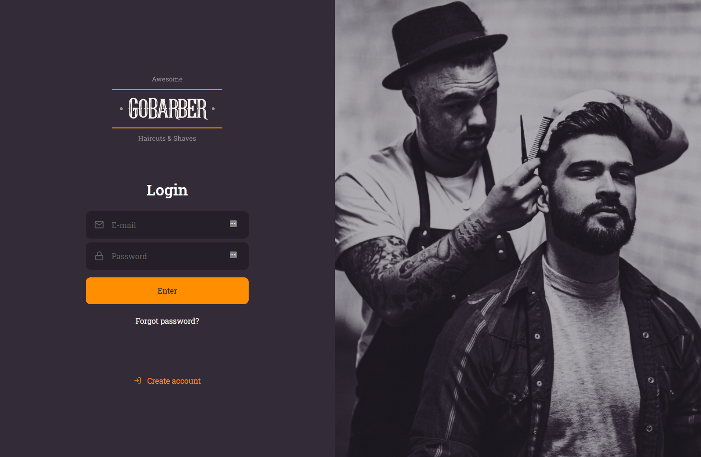

# GoBarber Backend API

## Overview

API developed to provide all the back-end services for the **GoBarber app**. It includes user account creation, profile update, password recovery, appointment schedule, notifications and other complementary methods.

## Technologies used

- Node.js
- TypeScript
- Express
- TypeORM
- PostgreSQL
- MongoDB
- Redis
- Multer
- Celebrate
- JWT (JSON Web Token)
- Tsyringe
- Jest
- Class-transformer
- Date-fns
- Bcryptjs
- Handlebars
- Rate-limiter-flexible

## Deployment

The API has been deployed using the Digital Ocean platform, using Ubuntu Linux and NGINx.

The API can be tested through the front-end page:
[GoBarber Web Page](https://gobarberweb.gabrielrocha.dev)

## Application screenshot

